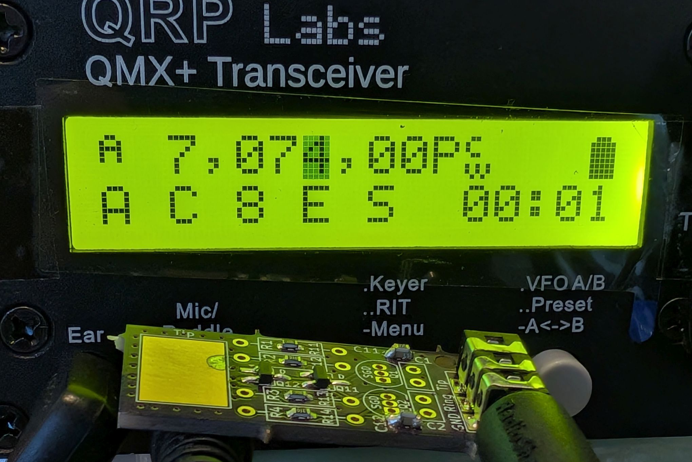
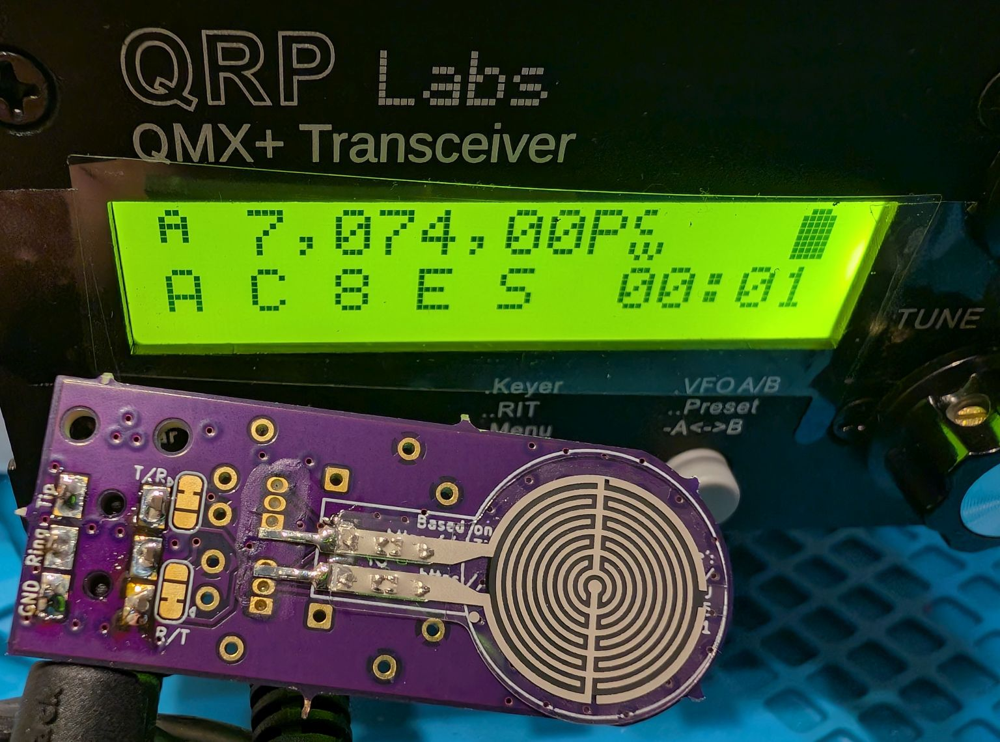
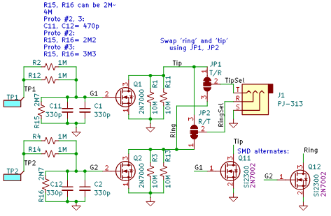
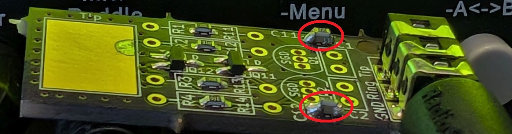
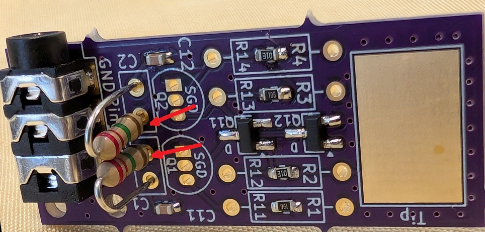
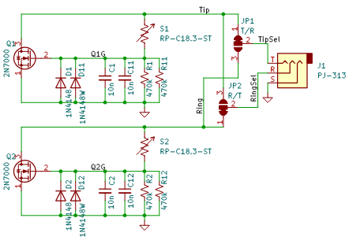
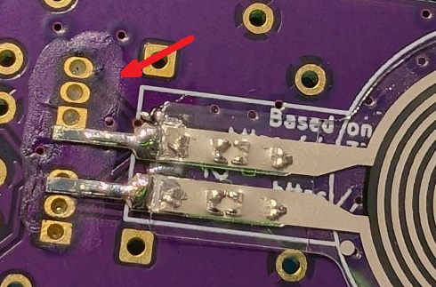
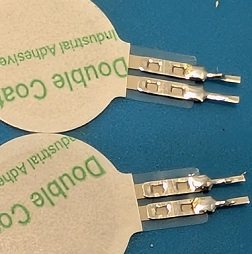
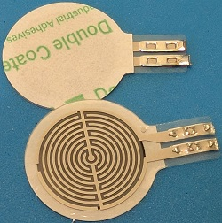
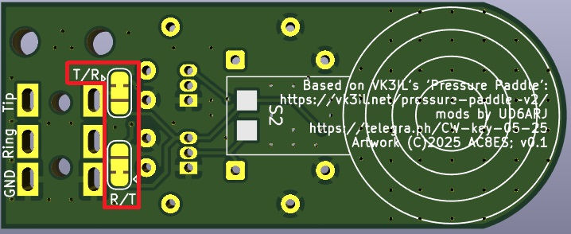

## Two Types of Touch Keyers (Paddles) for CW (Morse Code), Tested on the QMX+  

Implemented for use with the [QMX+ HF transceiver](https://qrp-labs.com/qmxp.html).  

The first is a capacitive touch keyer, based on "Penny Paddles", https://www.thingiverse.com/thing:7049323.

Capacitive touch keyer  
  

The second is a pressure paddle, based on https://vk3il.net/pressure-paddle-v2/.  

Pressure-sensitive touch keyer  
  

### Capacitive touch keyer  

The capacitive touch paddle is based on KD9AIE's [Penny Paddles](https://www.thingiverse.com/thing:7049323) schematic.  It has been slightly modified:  

The PCB has footprint provisions to use either surface-mount or through-hole components.  Note that a couple members of our local amateur radio club could not get the original schematic to work on a breadboard.  The following two modifications were found to work on the PCB:  
(1)  change the 2N7000 MOSFET to an SI2300 (note that the latter is suface-mount).  The are surely other non-2N7000 devices that are through-hole that will work.  The SI2300's gate drive voltage is about 1.5V lower than the 2N7000's.  
(2)  add a 2M- to 4M-ohm pull-down resistor to each MOSFET's gate. These can be placed on top of C11 and C12 (surface-mount), _or_ use the through-hole pad at C1, C2.  This change was needed to prevent continuous false triggers.  
Pull-down resistors mounted on top of C11, C12:  
  

Pull-down resistors mounted in pads for C1, C2:  
  

### Pressure-sensitive touch keyer  

The pressure-sensitive paddle is based on [VK3IL's 'Pressure Paddle' schematic](https://vk3il.net/pressure-paddle-v2/), with minor modifications by [UD6ARJ](https://telegra.ph/CW-key-05-25): 
  
UD6ARJ's modification adds two diodes (D1/D11, D2/D12 above), but I have not yet tested these.  As with the touch keyer, the PCB has footprint provisions to use either surface-mount or through-hole components.  

Although the force-sense resistor leads appear to be designed for through-hole mounting, the PCB has been set up for the leads to be tack-soldered, surface-mount style, so that the FSRs will sit on the PCB as flat as possible, and to avoid interference between the front/back FSRs.  
Note that the leads were slightly longer than expected.    The FSrs may be soldered, as-is, with a bit of insulating varnish under the exposed leads:  
  
or, the excess lead lengths may simply be cut off:  
   

Most suppliers of the RP-C18.3-ST FSRs charge around $4-5 each, plus shipping (even AliExpress).  If you're willing to buy 10 of them, they can be had on [Alibaba](www.alibaba.com/trade/search?&SearchText=RP-C18.3-ST) for $15-$20 total, including shipping.

### Swapping the Keyer Paddle 'dit' and 'dah'  

Radios like the QMX have a menu setting to swap the 3.5mm plug's ring and tip ('dit and 'dah) in software.  If desired, this may be electrically swapped on both PCBs using the solder bridge jumpers.  On each solder jumper, place a solder bridge over the open pads, and cut the short trace segment, near the silkscreen arrow indicator.  
  
