## Two Types of Touch Keyers (Paddles) for CW (Morse Code), Tested on the QMX+  
## Plus, a PTT Microphone PCB for the QMX/QMX+

Implemented for use with the [QMX+ HF transceiver](https://qrp-labs.com/qmxp.html).  
PCBs designed in KiCAD v9.

The first keyer is a [capacitive touch keyer](#capacitive-touch-keyer), based on "Penny Paddles", https://www.thingiverse.com/thing:7049323.

Capacitive touch keyer  
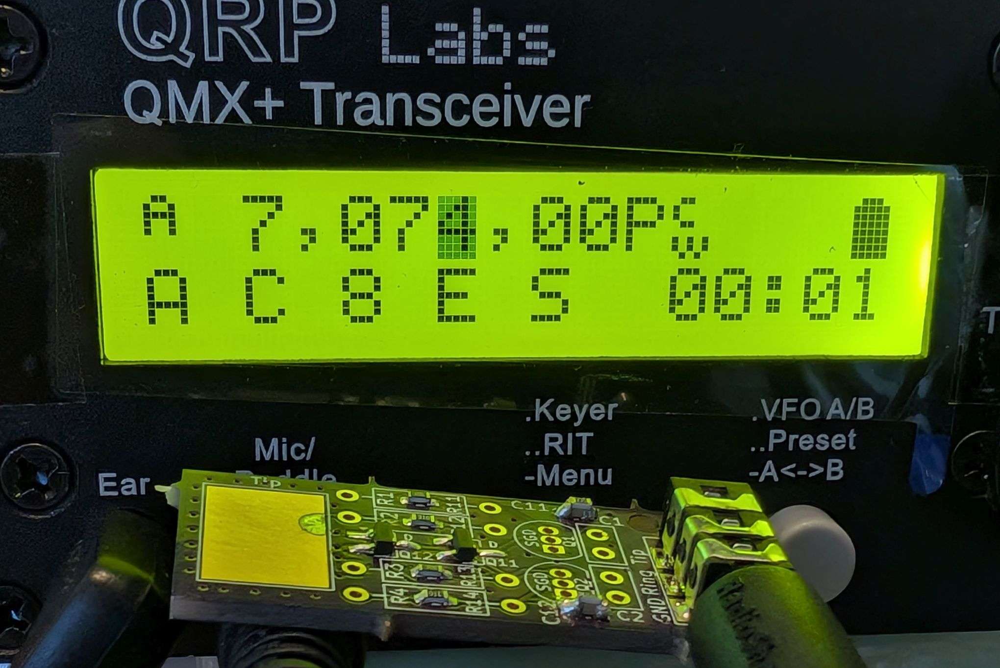  

The second keyer is a [pressure paddle](#pressure-sensitive-touch-keyer), based on https://vk3il.net/pressure-paddle-v2/.  

Pressure-sensitive touch keyer  
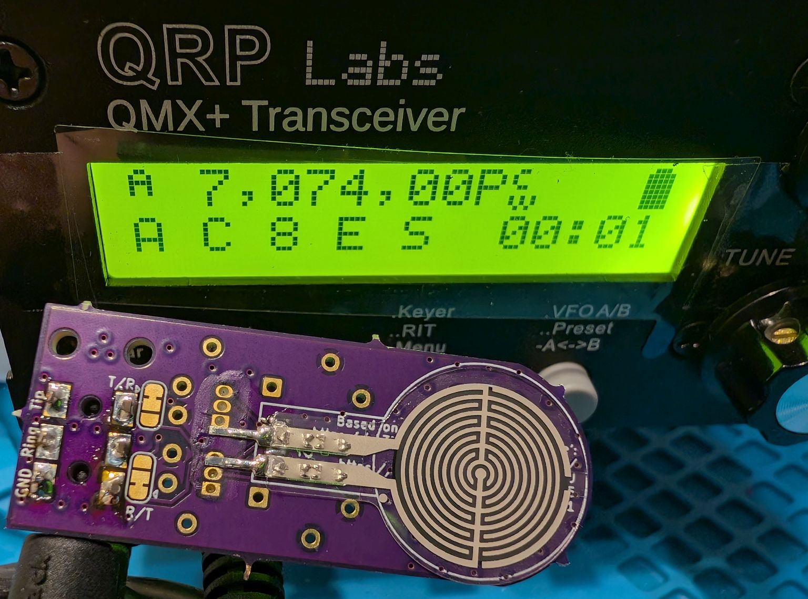  
  
  
Thirdly, there is a [PTT microphone PCB](#ptt-microphone-pcb):  
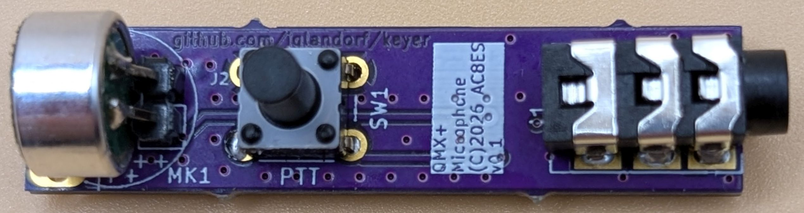  

### Capacitive touch keyer  

The capacitive touch paddle is based on KD9AIE's [Penny Paddles](https://www.thingiverse.com/thing:7049323) schematic.  It has been slightly modified:  
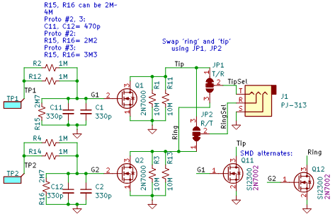

The PCB has footprint provisions to use either surface-mount or through-hole components.  Note that a couple members of our local amateur radio club could not get the original schematic to work on a breadboard.  The following two modifications were found to work on the PCB:  
(1)  change the 2N7000 MOSFET to an SI2300 (note that the latter is suface-mount).  There are surely other non-2N7000 devices that are through-hole that will work.  The SI2300's gate drive voltage is about 1.5V lower than the 2N7000's.  
(2)  add a 2M- to 4M-ohm pull-down resistor to each MOSFET's gate. These can be placed on top of C11 and C12 (surface-mount), _or_ use the through-hole pad at C1, C2.  This change was needed to prevent continuous false triggers.  
Pull-down resistors mounted on top of C11, C12:  
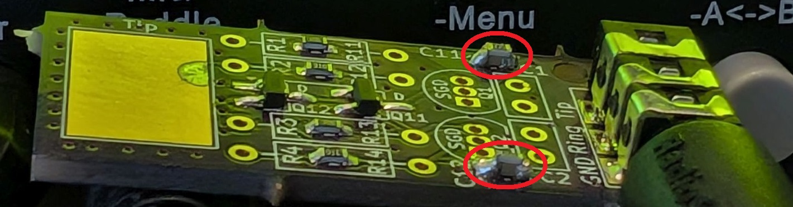  

Pull-down resistors mounted in pads for C1, C2:  
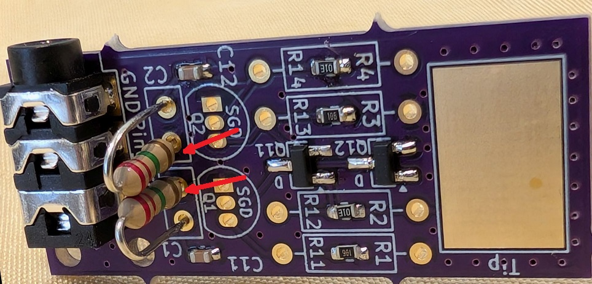  

### Pressure-sensitive touch keyer  

The pressure-sensitive paddle is based on [VK3IL's 'Pressure Paddle' schematic](https://vk3il.net/pressure-paddle-v2/), with minor modifications by [UD6ARJ](https://telegra.ph/CW-key-05-25): 
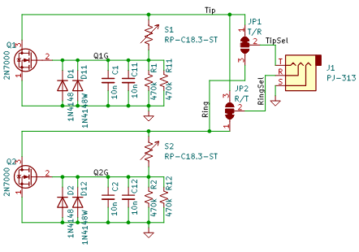  
UD6ARJ's modification adds two diodes (D1/D11, D2/D12 above), but I have not yet tested these.  As with the touch keyer, the PCB has footprint provisions to use either surface-mount or through-hole components.  

Although the force-sense resistor leads appear to be designed for through-hole mounting, the PCB has been set up for the leads to be tack-soldered, surface-mount style, so that the FSRs will sit on the PCB as flat as possible, and to avoid interference between the front/back FSRs.  
Note that the leads were slightly longer than expected.    The FSrs may be soldered, as-is, with a bit of insulating varnish under the exposed leads:  
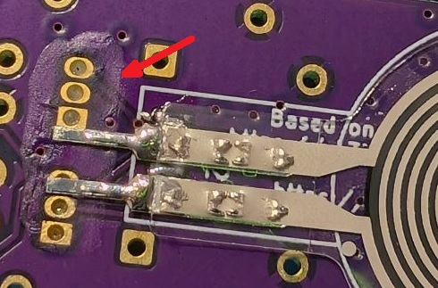  
or, the excess lead lengths may simply be cut off:  
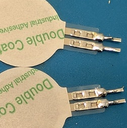 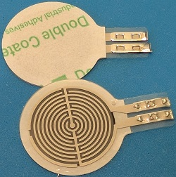  

Most suppliers of the RP-C18.3-ST FSRs charge around $4-5 each, plus shipping (even AliExpress).  If you're willing to buy 10 of them, they can be had on [Alibaba](www.alibaba.com/trade/search?&SearchText=RP-C18.3-ST) for $15-$20 total, including shipping.  The FSRs used for the prototype is from [this supplier](https://www.alibaba.com/product-detail/Intelligent-FSR-402-Thin-Film-Pressure_1600649457578.html).

### Swapping the Keyer Paddle 'dit' and 'dah'  

Radios like the QMX have a menu setting to swap the 3.5mm plug's ring and tip ('dit and 'dah) in software.  If desired, this may be electrically swapped on both PCBs using the solder bridge jumpers.  On each solder jumper, place a solder bridge over the open pads, and cut the short trace segment, near the silkscreen arrow indicator.  
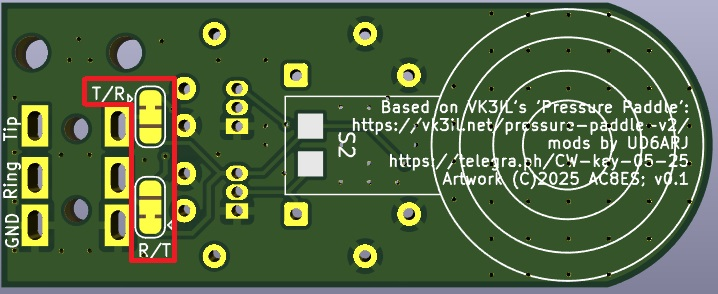  

### PTT Microphone PCB  
The QMX/QMX+ uses an external microphone for single sideband (SSB).  This PCB mounts the electret microphone, a push-to-talk (PTT) switch, and a 3.5mm, 3-pin, "TRS" audio jack.  A 3.5mm TRS audio cable (not shown) connects between the PCB and the QMX/QMX+ front panel. 
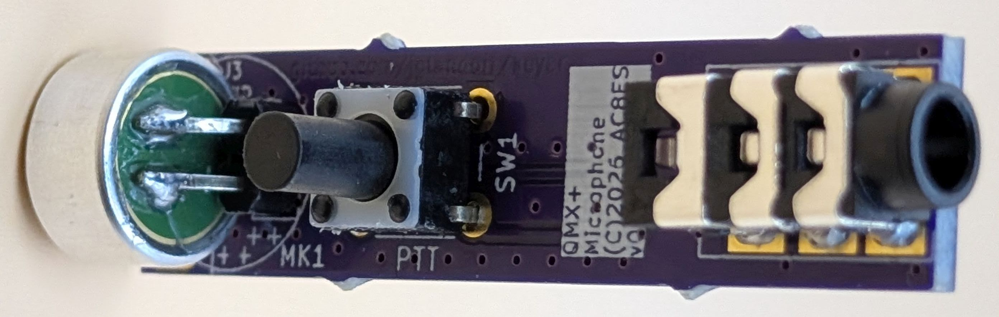  
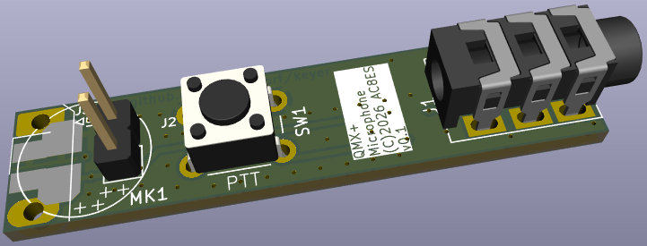  

Bill-of-materials:  
[html BOM ](bom/qmxMic_0.1.html) with component placeemnt pictorial  

| Reference | P/N |  Description | Link |  
| --- | --- | --- | ---- |  
| J1 | PJ-313 | 3.5mm TRS receptacle | [AliExpress](https://www.aliexpress.us/item/3256806149850933.html) |  
| MK1 | AOM-5024L-HD-F-R | _official_ microphone | [Mouser](https://www.mouser.com/ProductDetail/PUI-Audio/AOM-5024L-HD-F-R?qs=GedFDFLaBXHwFCQszj3hAw%3D%3D) |  
| MK2 | MW042502-1 | †_alternate_ mic | [Mouser](https://www.mouser.com/ProductDetail/DB-Unlimited/MW042502-1?qs=wT7LY0lnAe2ReVyhYwHtvg%3D%3D) |  
| SW1 | ‡† | 6x6mm tactile switch | [AliExpress kit](https://www.aliexpress.us/item/3256806914965075.html) |  
| J2 | --- | 2-pin header, 0.1" | ---- |  
| --- | --- | 3.5mm-to-3.5mm M-M audio cable | ---- |   

† This 4.6mm diameter _alternate_ mic is yet to be tested.  It comes with ~100mm wire leads soldered on.  Cost is about half the _official_ mic.  
‡ 9.5mm total-height tactile switch is shown in photos; ~4.3mm total-height switch is shown in the 3D image above.  9.5mm is very close to the 9.7mm diameter of the _official_ microphone. These switches are commonly available with total heights of 4.3/5/6/7/8/9/10/11/12/13mm and longer.  

Schematic:  
"MK2" is a smaller, less expensive alternate microphone (_to be tested_).  
J3, J4, and J5 are alternate mounting pads for either microphone.  
For potential use with other radios, the 3.5mm jack's 'tip' and 'ring' terminals may  be swapped via the solder bridges JP1 and JP2.

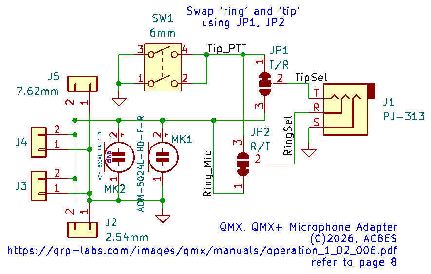  
  
Assembly:  

Note that the 3.5mm jack and the PTT tactile switch may be mounted on either side of the PCB.  __Before soldering, press-fit them in various combinations of front- and back-side mounting.__  
If using J2 (2x 0.1" pin header) to mount the microphone, bend the pins slightly outward as shown.  __When soldering the mic, be sure that J2's pins do not short to mic's metal housing.  Make sure the housing does not short to any nearby pads.__

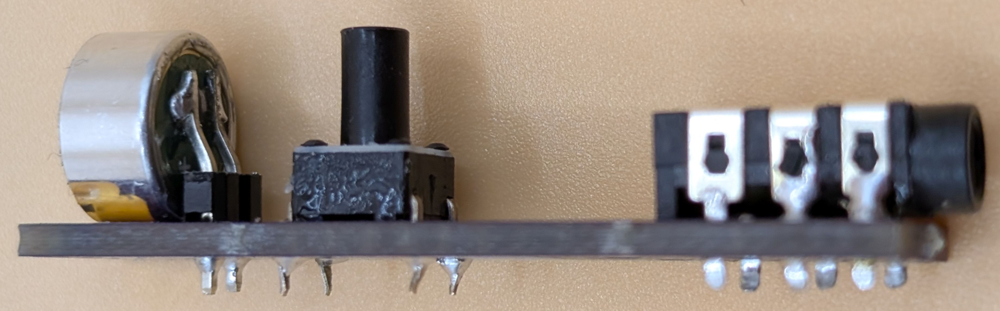  
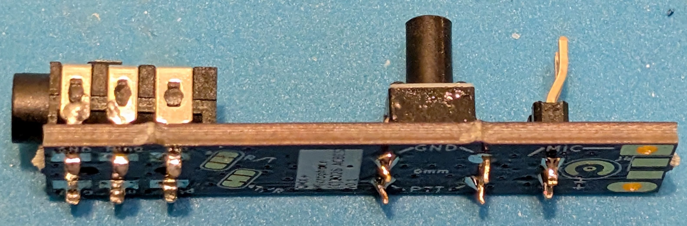  
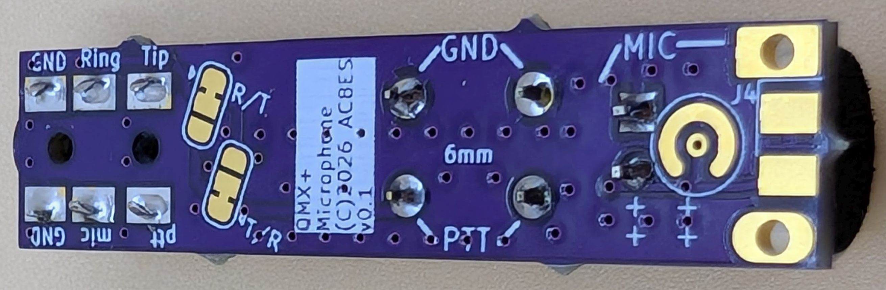  
  

Set-up with QMX  

Setup for the microphone is described in section 5.11 "SSB menu" of the [QMX Operation manual](https://qrp-labs.com/images/qmx/manuals/operation_1_02_006.pdf).  Refering to the "Mic AGC submenu", __be sure to set _Input_ to _Ext. mic_.__  An alternative test using the built-in terminal app is described in the manual's section 8.6.9 "microphone test".

